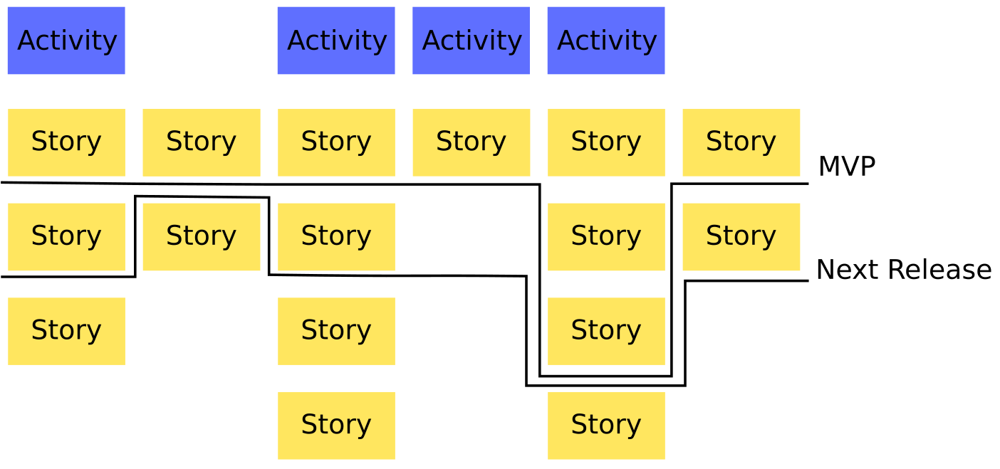

## ENSE 271 - People-Centred Design - Laboratory

# Lab 1: User Story Mapping  with Stories on Board

### University of Regina
### Faculty of Engineering and Applied Science - Software Systems Engineering

### Lab Instructor: [Adam Tilson](mailto:Adam.Tilson@uregina.ca)

---

## What is User Story Mapping?

A UX exercise credited to Jeff Patton originally documented in his article "It’s All in How You Slice It (2005)" and later a book published by O’Reilly. It has grown iteratively over time.

It is an exercise which produces a card-based planning model.

## Guiding Principle

Challenge the old Software Engineering adage: "If you build the highest value feature first, users will love your release”. It this is not true if it is lacking required low-value (secondary) features. 

e.g. If you are designing a photoshop clone, a high demand feature might be cool new AI tech for context aware fills. But if you are missing the basics (crop, resize, etc.) then your tool will not get much long term use.

## Who should participate in User Story Mapping:

- Never one person!
- A team of four to eight stakeholders from different roles
- Domain experts, testers, UI designers, business people

## Eight Steps

In the original article, eight steps were presented in the activity of user-story mapping. These need not be followed rigidly, but still explain the general idea.

1. Collect Features
2. Add Details
3. Place Cards in Sequential Order
4. Group by Frequency
5. Note Logical Breaks in Workflow
6. Mark the First System Span
7. Fill in Build Estimates
8. Slice and Serve

In Detail:

1. Collect Features

   - Answer the question “What does our software do?”, expressed from a user perspective.

    - Write these on business cards or index cards

2. Add Details

    - What kind of user uses the feature, (role, persona, etc.)
    - How often, (daily, weekly, monthly, hourly?)
    - How valuable is the feature? (high, medium, low)

Original Proposed Example Card:

---

**create po for vendor**

(merchandise buyer)

frequency: weekly

value: medium

---

- With all these cards this might feel like Monopoly. 

- Note that this style has later been standardized by M. Cohn to the User Story approach:

    - As a _type of user_ I want _some goal_ so that _some reason_.


3. Place Cards in Sequential Order

- On a poster board:
    - label the X-axis “Usage Sequence”
        - We will follow the western convention that left happens earlier, right happens later, though this can be modified for working in other cultures with different conventions.
    - label the Y-axis “Criticality” 
        - Features at the top are always used, features at the bottom are rarely used
```
                                   Usage Sequence
          Used Earlier                                       Used Later
       <------------------------------------------------------------------→
      (Always Used)
            ^
            | 
Criticality |
            v
       (Never Used)
           ```
```
- Usage sequence refers to tasks that have to happen in order, 
    - e.g. collect ingredients before starting cooking

- If events happen simultaneously, arrange them logically. 
    - e.g. I was to ask you "List for me everything your system does", what order would you list the features? That should be the order you place them.

- As a group, place the cards in just one row across the top. 

4. Group by Frequency

    - As a group, adjust the vertical position of each card based on how critical they are to the system success...

    - We’ve gone from playing Monopoly to Twister!

5. Note Logical breaks in Workflow

    - As you go left to right through the model, you’ll find breaks, typically where tasks shift from one person performing the task to another. 
    
    - Draw in vertical dashed lines at these points to divide into business processes.

    - If you are having difficulty finding these divides, discuss why.

6. Mark the First System Span

    - Identify the smallest set of features to be minimally useful in a business context.

    - Draw a horizontal line under the row which makes up the first span

    - The line does not need to be straight across - weave up or down to grab the features you want or exclude features you don't want.

    - These are the highest priority features in each business process

    - Some vertical lanes might be empty.

    - This top row represents the bare minimum of features which must be in your first release, even if this is only an internal release, so that you can start testing.
        - This initial system span is called a Minimum Viable Product, MVP

7. Fill in Build Estimates

    - Have devs write implementation time estimates directly on the cards.  Add up the values across the top line – this is time to the MVP

8. Slice and Serve

    - Have the business people decide which features need to be in each release, by drawing additional jagged lines across the remainder of the poster.

## What we're left with...

- We’ve found dependencies. We’ve found criticality. 
- We know the features set to get your system up and running.
- We can also see functionality needed for a single person or role

## Limitations

- Good concepts are rarely static, and this one naturally evolved by the original author and other contributors.

The biggest problem at this state is "Granularity". 
- We need to extract the big picture to contextualize the tasks.

## Advances

In the aim of addressing the granularity problem, the following adjustments were adopted:

- In the top tier is the "Big Stories", a.k.a. `User Activities` (Norman)
    - Commonly called `Epics`, they are more like "chapters" in a story
    - This row is called the `Backbone`
    - Provide context to the tasks, so we don't lose the big picture
        - If a unit of work is too big to be used to make meaningful estimations, it should be further decomposed

- The second row down are the `Steps`. together making the `Walking Skeleton` (Cockburn). 
    - You should be able to walk through the tasks in this row and feel everything fits together logically
        - There should be no missing steps
        - It can be useful to do this process with the client. This is what you want to build first.
    - Some groups use a different card color for this row.

- Everything underneath are `Tasks`, or `Details` in decreasing importance. 
    - These are our skeletal `ribs.`

* It is important to note that there may be some differences in terminology between how other people use this technology.

## In Practice...

In the real world, Software developers rarely stick to rigidly defined rules, and modify these techniques as needed. 
- Some people want more levels of granularity, some want fewer. 
- You may see two colours of cards used, one for the backbone and one for tasks, or three colours, for the backbone, walking skeleton and tasks.

I've also seen this tool mixed with Kanban as follows (Holub): include "piles" of tasks on the sides: on the left are ideas that you are still working on / not sure how it fits into the big picture yet, but you don't want to lose, and a pile on the right for features which are complete to give a motivating sense of progression.

Finally, software has made this process completely virtual, which we will demonstrate using Stories on Board.

## In Images...

Laying out cards and arranging into lanes


Explaining the terminology of the map


Drawing lines for iterative releases



---

## StoriesOnBoard

Let's head over to [storiesonboard](https://app.storiesonboard.com/login). Tim should have set you up with accounts.

In order to quickly see the capabilities of the software, you should create a new board, and instead of starting from scratch, start from the Guide Map:


You should see a new board:


It is somewhat intimidating. Let's take a look around, moving clockwise from top-right...


1. Here we can navigate between this and other maps
2. In this section we can add collaborators, zoom our map, filter which cards are displayed, and change what appears in the sidebar.
3. This is the sidebar, in this area you can perform various task depending on what you have selected from section 2, such as view board conventions, edit personas, and discuss the board.
4. Center stage - this is where you will spend most of your time working, adding cards, organizing them, adding time estimates, and moving them through the various stages.

Let's zoom in on the upper left of center stage:


1. As the vertical "swim lanes" tend to correspond to different people or roles, it may make sense to assign personas to these tasks.
2. Time estimates for our larger stories are derived from the sum of the time estimates of the smaller tasks.
3. We can create releases and assign cards into each. Some feedback is given for the release, including how many cards and hours remain, and how many cards are not yet estimated.
4. We can set the status of a given card, from the options of `TODO`, `READY`, `DOING` and `DONE`.
5. We can set a time estimate for each task, which is used for computing the total time for a given lane, as well as the time remaining for a given release.
6. Cards can be annotated with a number of symbols explained in the "About This Board" legend.

We can also see an overview of our progress by clicking on the progress part of the release, e.g. `14 CARDS, 76 LEFT OF 91 HOURS`


Simple card modifications such as renaming and adding can be accessed from the menu in the bottom right of a card


Let's Interact with a card in detail...
- Right Click to change color
- Double Click to edit in detail...


1. Here we can see the title of the card
2. The user story, as well as some details about the card go here. You can use [MarkDown](https://github.com/adam-p/markdown-here/wiki/Markdown-Cheatsheet) to make this look better, add images, links, etc.
3. Comments for other members of the team
4. Modify the card
5. Details about the card such as status and estimate. You can add your time estimate here.

This is a good overview of the software. Before you leave the Guide Map and head into your own map, check out the cards in this region:


And if you want more help, check out the documentation here: [Read Some Docs!](http://docs.storiesonboard.com/en/)

---

## Quick Example:

Imagine that you just recieved a brand new phone. You would like to download and playing a mobile game. What are some user stories? Which are Activities? Steps? Tasks? Which are the most important?

Another way of thinking about this, what does the user actually want to do (Activities), and what are they forced to do (Steps, Tasks) in order to accomplish this goal? 

---

## Assignment

Planning your semester:

Using stories on board, create a new board which represents part of your study schedule for the current semester. Using User Story Mapping principles, try to plan out some of the tasks you need to do, such as attending lectures or completing labs. Note that User Story Maps are not exactly designed for this type of planning, so it may not work perfectly for all the tasks, which is fine. It also does not need not be totally realistic or accurate, if you wish you can make stuff up, the purpose is simply to get some experience using the software. In accomplishing this, include:

- At least three epics in the backbone
- At least six steps in the walking skeleton
- At least 18 total tasks
    - All tasks need to have a name, status and time estimate
    - Edit the details for at least three tasks and try out different [markdown](https://github.com/adam-p/markdown-here/wiki/Markdown-Cheatsheet) features
- At least 2 releases
- Experiment at least one extra feature, such as additional card colors, annotations or personas

---

## Submission

To facilitate marking, please submit screen captures of the following:
- An overview of the map
    - Expand your username (Upper Right) in the screen capture so that your identity can be verified.
- Your three detailed tasks
- Include a readme.txt explaining which extra feature you experimented with

Please submit to URCourses by the deadline.

---

## References

J. Patton, [It's All in How You Slice It](https://www.jpattonassociates.com/wp-content/uploads/2015/01/how_you_slice_it.pdf), Better Software, 2005.

J. Patton, User Story Mapping: Discover the Whole Story, Build the Right Product, O'Reilly Media, 2014.

J. Patton, [The New User Story Backlog is a Map](https://www.jpattonassociates.com/the-new-backlog/), Jeff Patton & Associates, Accessed 2021

M. Cohn, [User Stories](https://www.mountaingoatsoftware.com/agile/user-stories), Mountain Goat Software, Accessed 2021

A. Holub, [Picturing Architecture: UML (The Good Bits)](https://app.pluralsight.com/library/courses/picturing-architecture-uml/table-of-contents), Pluralsight, 2016