## ENSE 271 - People-Centred Design - Laboratory

# Lab 4: Hi-Fi Prototypes with Adobe XD

### University of Regina
### Faculty of Engineering and Applied Science - Software Systems Engineering

### Lab Instructor: [Adam Tilson](mailto:Adam.Tilson@uregina.ca)

---

## Introduction

In the previous lab we looked at using Adobe XD to make medium fidelity prototypes. However, these were only static sites with no interactivity. We will now look at using the Adobe XD Prototyping workflow to add some interactivity to our websites.

Download the starting files from URCourses, and open up `travel-hyrule-starting.xd`.

We will see a bunch of 

Things we will do:
- Setting a home page and previewing
- Connecting the hamburger menu to each of the pages
- Add an automatic carousel to the first page
- Have a unique interaction on each of the strange 
    - A slow fade on the `shrines` page
    - A draggable gallery on the `divine beasts` page
    - A carousel with buttons on the 
- Add some lightboxes to the `locations` page

## Prototyping, Home Page and Previewing

Switch to prototyping mode using the top menu

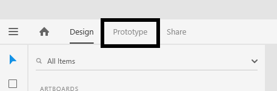

Set the home page by selecting the page and clicking the home icon...

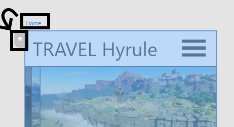

You can preview your page by clicking on the preview icon.

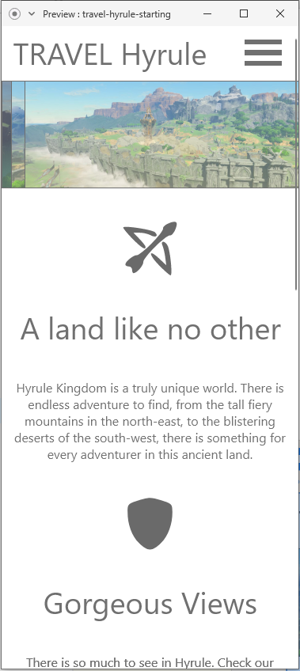

This will open up your view. You can scroll around and click on things, but not much will happen yet. Let's try to fix that.

## Wiring up the home menu

Click on the hamburger menu. New gizmos will appear. Click on the arrow and drag it to the menu screen to the left.

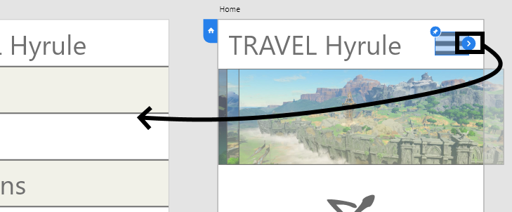

You will see that it is wired correct if a curved blue line connects the screens.

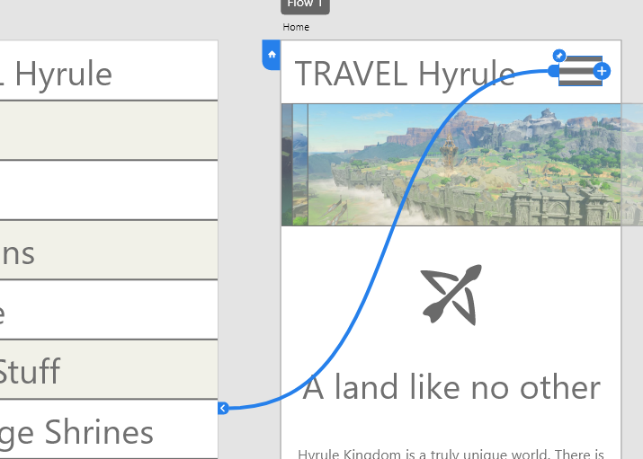

In the inspector, set the animation type to tap, overlay and slide down

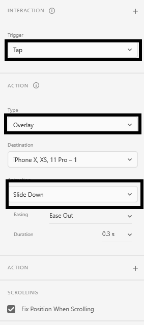

Once an animation is set, if you wire up another link, it will copy the same settings. Use this to link up the hamburger menus on the other pages...

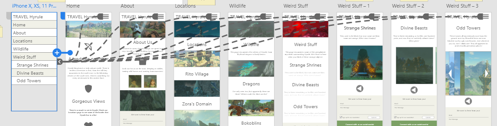

You also need to wire up the hamburger menu of links back to the appropriate pages. Let's start with the home page.

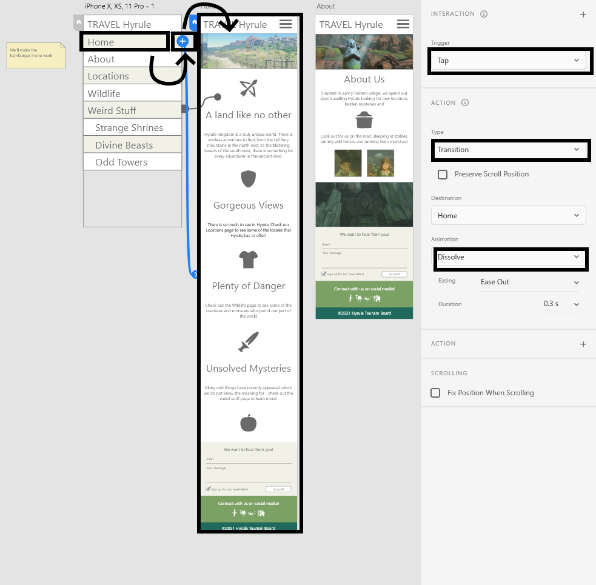

And then set the other pages too...

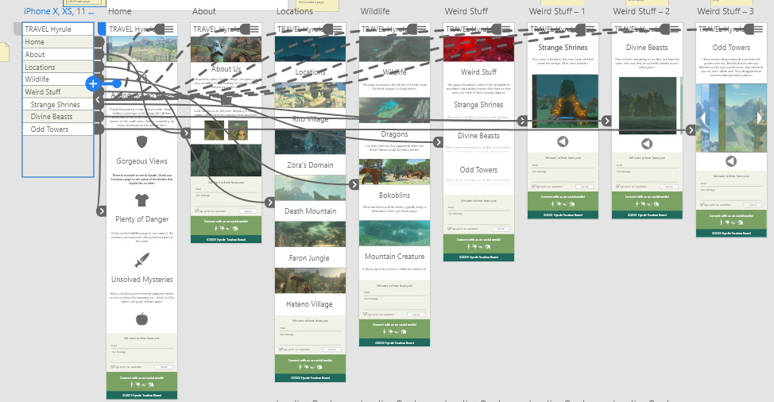

Getting pretty crazy.

Run your preview again, and confirm that all of the links are working correctly.

This is all you need to do to link pages together in your prototype. In the next sections we will work on animations to bring the pages to life.

We can also connect the `Weird Stuff` page to the three sub pages...

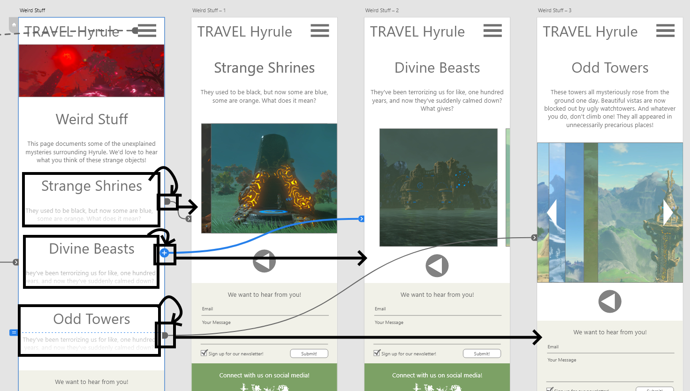

Using these animation settings:

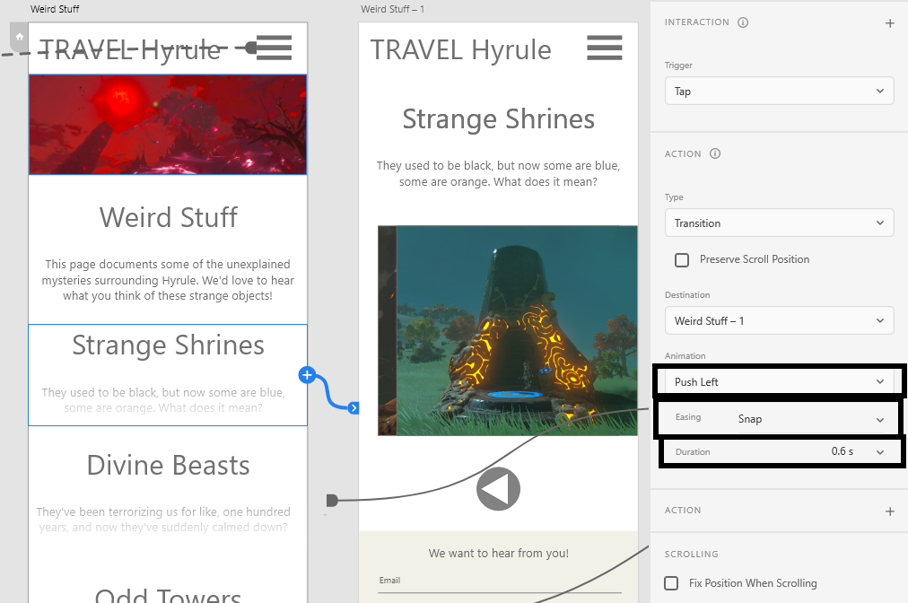

Each of these pages has a back button, which we can wire back to the previous page. We should also choose an animation that mirrors the one which arrives at this page: 

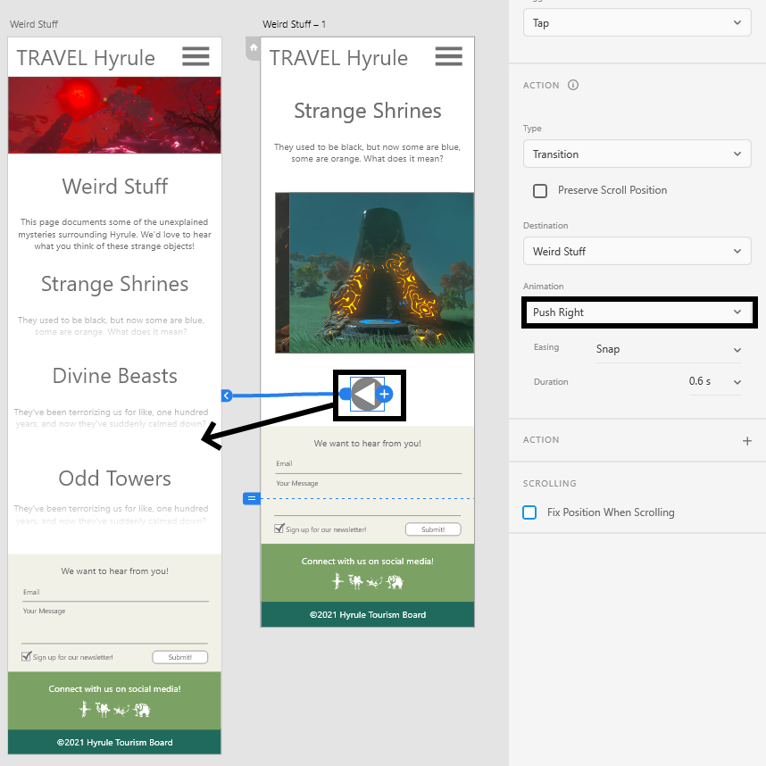

Test it out, does it go forward and backward as expected? You can try different animations for the three pages, forward and back, to see what you like.

## Automatic carousel 

On the top of the home page, in the image bar, I have placed three images offset slightly to the left. We want to make an animation which automatically transitions through these three images at regular intervals.

To create animations, we need to create a few keyframes. Switch to `design`, and drag the home page down into some open space so it easier to work with. Then make two copies of the home page, using ctrl+d. Delete and reposition the images in the top bar so that one and only one unique image exists in the same place in each of the three artboards:

Connect the first artboard to the second with the following settings:

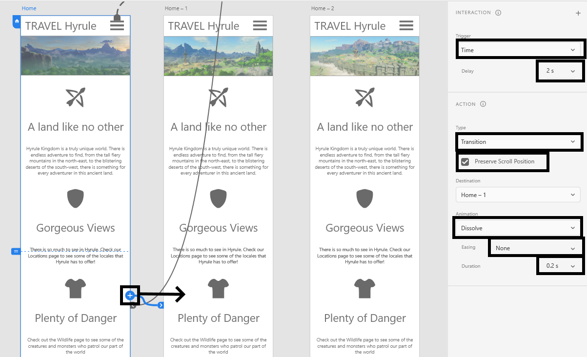

Wire up the second to the third screen, and the third screen back to the first.

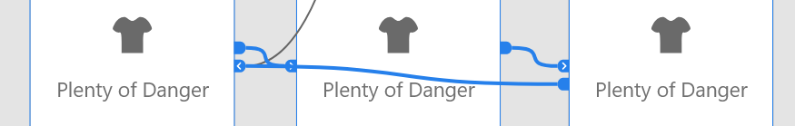

Preview the page. The image should swap automatically every few seconds.

Note that the hamburger menu may have disconnected on the duplicated pages. If so, wire them back to the menu page.

## Auto-fade Animation on Shrine page

In this section we'll make a slow transition on the shrine page. Duplicate the shrine page, and center one of the two shrine images in each page. Finally, add effects back and forth with the following settings.

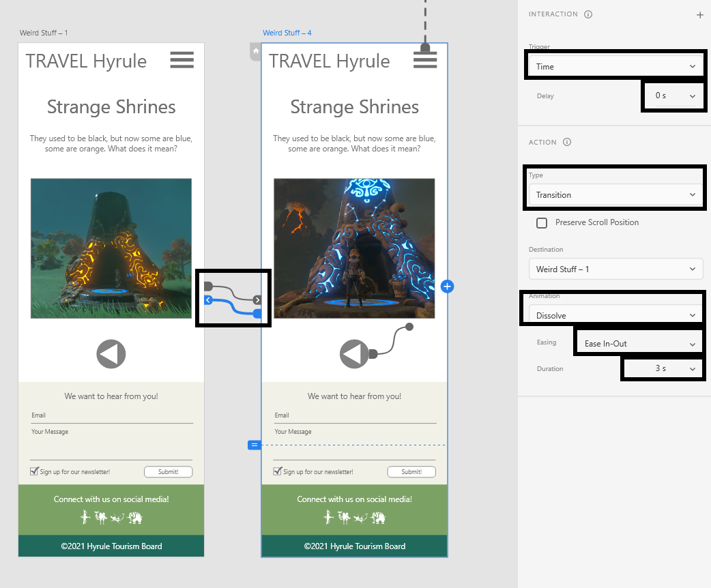

Preview the page. This effect looks pretty neat. However, notice that scroll is disabled when an animation is playing. These types of animations should thus be sparingly, for example, on splash screen pages and pages without scroll.

## Draggable Gallery Page

On the Divine Beasts page we will simulate a draggable scrolling gallery effect.

For this effect we will need six total keyframes, but we will make four to start.

Duplicate the page, and move the image slider so that one of the four images is in the middle of the frame:

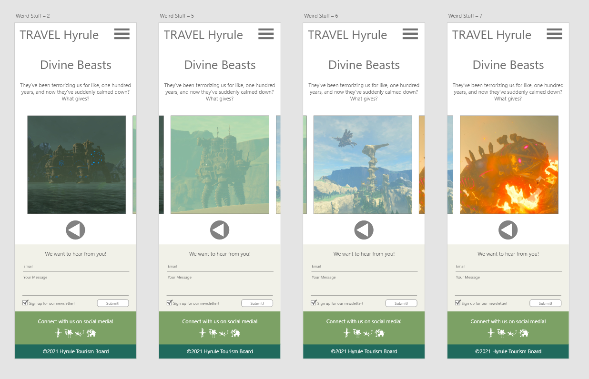

To make this effect even more interesting, we will zoom in on the selected beast in each frame. Switch to design, double click on the image to get into the group, then double click again to get the original masked image. Scale it up a bit so that it is in more frame. Do this for each of the four beasts in their appropriate artboard.

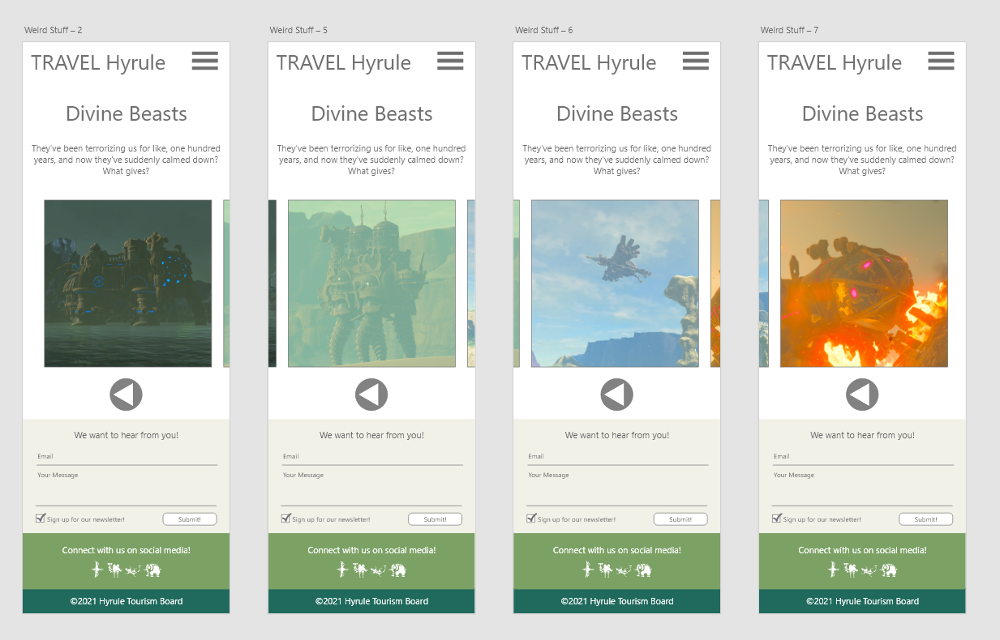

We need two more keyframes to make this worked. Duplicated the third artboard as the fifth, and the second artboard as the sixth.

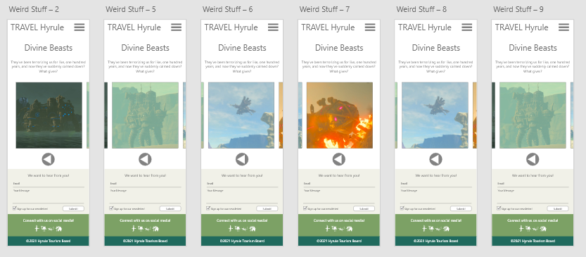

Now we'll add our animations. Remember to add one animation first, adjust the settings, and then add more. Select the image banner on the first keyframe, and connect it to the second, with the following settings:

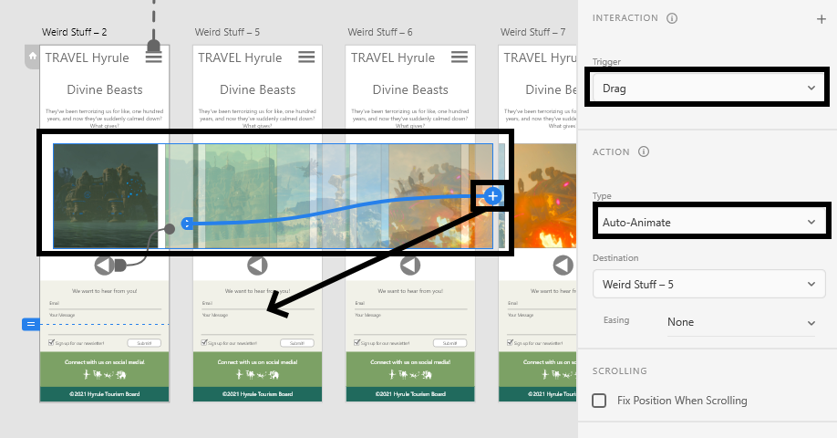

It may be tricky to find the connector on the banner, look to the right side of it, which will be different in each of the images.

Once you have the settings right, connect the other images to their keyframe to the right, and connect the last image back to the first page.

Test the page. Drag through your images all the way to the right, and then all the way back to the left. The limitation to this animation is that you can only drag in this specific order, but it's still a need animation.

## Five image carousel with arrows and progress buttons

The final "Weird Stuff" page will have a five image carousel.

As always, drag it down somewhere you can work, and duplicate it into five keyframes. Have a different of the five images in each keyframe. Also, change the fill on the little circles so that they match up with their keyframe.

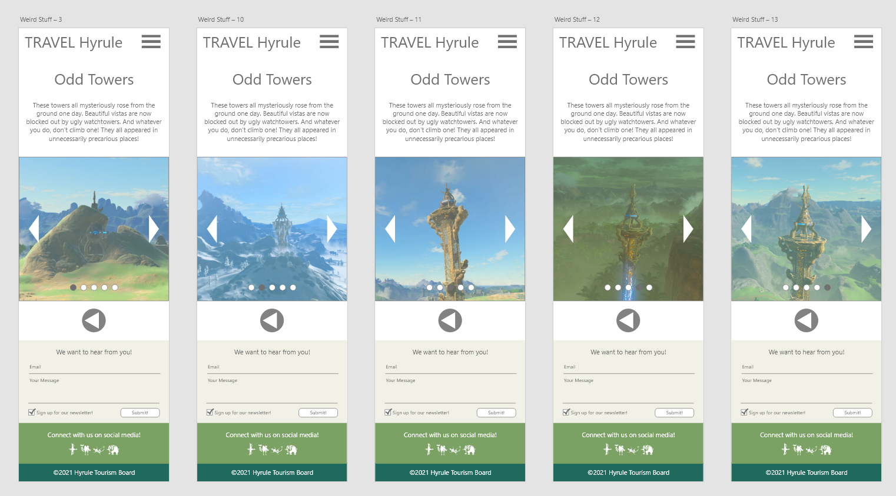

This one is easy. You just need to wire up the triangles to the next or previous slide (and don't forget to wrap around from the last to the first, and vice versa.) Don't forget to set the animation style after drawing the first wire! Also wire up the circles to the corresponding image. These settings work well:

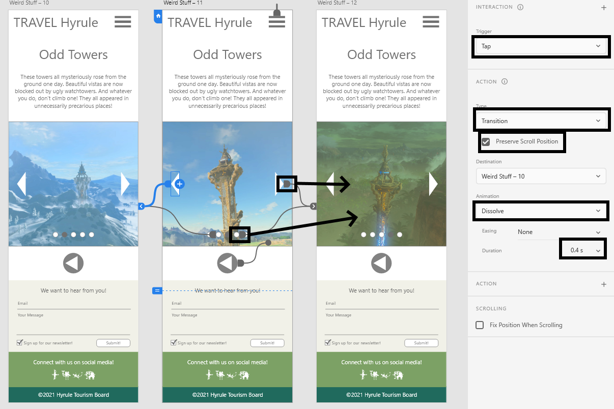

Each page should have six exists (two arrows and four circles) to make the gallery work. When it's all wired up, it will be quite a mess!

Test it out. The arrows are easy test, the bubbles slightly less so, as you would need to test all four exists from each page! I test first page to the remaining four and back, second page to the remaining three and back, third page to the remaining two and back, etc.

## Lightboxes for the location page.

The last thing we are going to do is add some Lightboxes to the location page. This will allow the user to click on the text at various points in the page, and have a pop-up appear with more information.

Move the location page near the four lightboxes...

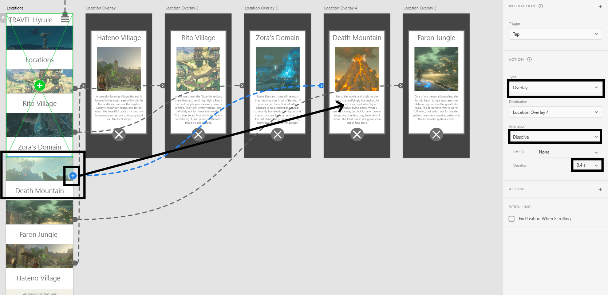

Test it out. You may click anywhere on the lightbox to close it, but a close icon was included in the image in case that isn't obvious. Additionally, the dimming effect is caused by a slightly transparent placed under the info box in the lightbox.

And that's it. The full website is accessible, with several interesting effects. Test it out to see if anything is broken. Are all the hamburger icons leading to the menu page? You can verify by clicking on the menu and tracing all of the dashed lines.

---

## Assignment

Due to the pandemic, many public places are closed to the public, such as museums, art galleries, aquariums and zoos. Due to this, many have attempted to do `virtual museums`. Your assignment is to pick such a place and create a virtual tour in Adobe XD. Your tour should include:
- A home page
- Some type of menu
- Three exhibits, with a page for each
    - Each exhibit should have a name, a set of images and text
    - The images should be stored in some type of interactive container
        - You can use ones from the prelab, or create your own
    - Use a different type of interaction for each page

Please include some images from the exhibits. Many museums license their images in the creative commons, but even if not, it is okay to use them in this project as it is for educational / non-commercial purposes.

---

## Submission

Please submit your `.xd` files to UR Courses by the due date.

---

## References

W. Everhart, [Abode XD CC Fundamentals](https://www.pluralsight.com/courses/adobe-xd-cc-fundamentals), Pluralsight, 2018

E. Key, [Prototyping a WordPress Project in Adobe XD](https://www.lynda.com/Web-tutorials/Prototyping-WordPress-Project-Adobe-XD/2809592-2.html), Linda from LinkedIn, 2019
