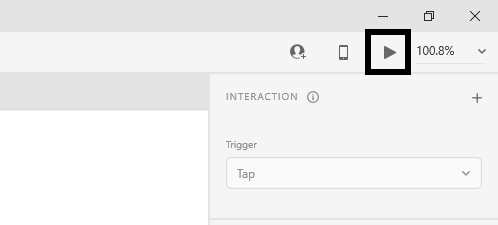
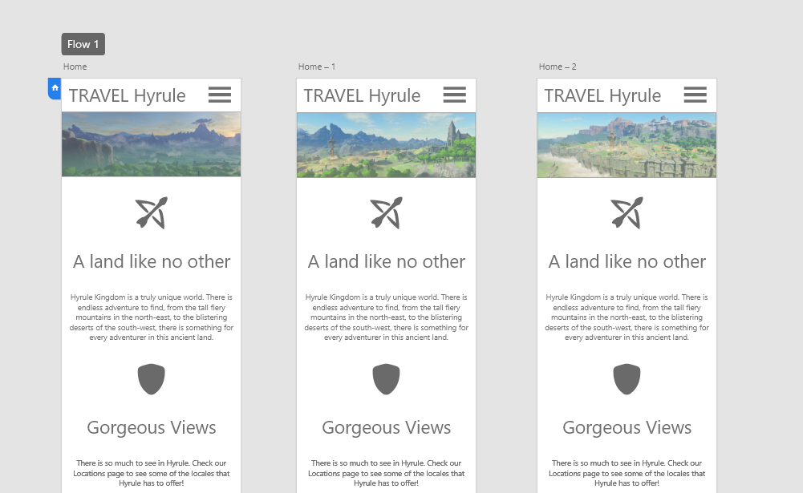
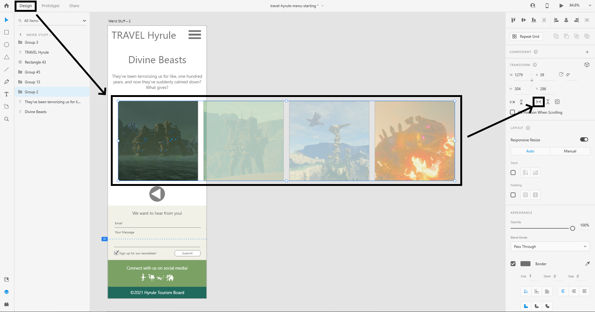
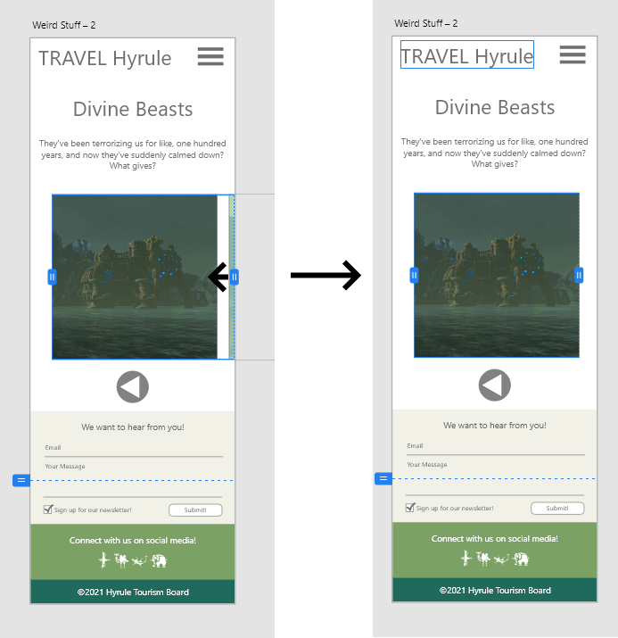
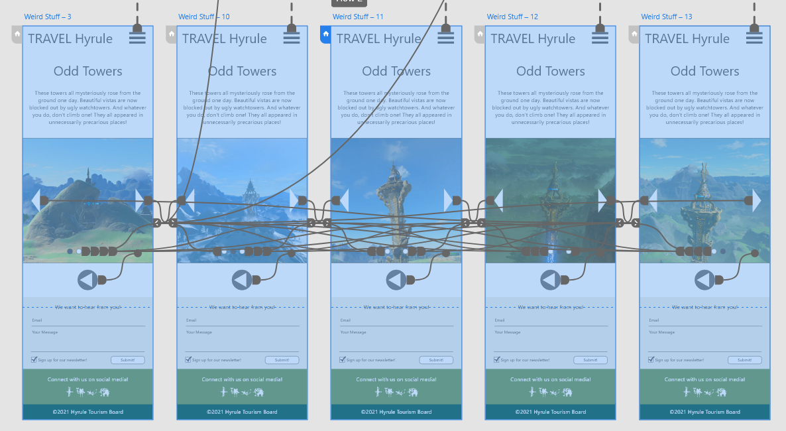

## ENSE 271 - People-Centred Design - Laboratory

# Lab 4: Hi-Fi Prototypes with Adobe XD

### University of Regina
### Faculty of Engineering and Applied Science - Software Systems Engineering

### Lab Instructor: [Adam Tilson](mailto:Adam.Tilson@uregina.ca)

---

## Introduction

In the previous lab we looked at using Adobe XD to make medium fidelity prototypes. However, these were only static sites with no interactivity. We will now look at using the Adobe XD Prototyping workflow to add some interactivity to our website mockups, which we can demonstrate using the `preview` function.

Download the starting files from URCourses, and open up `travel-hyrule-starting.xd`, a mobile tourism site for a fictional land.

We will work together through:
- Setting a home page and previewing
- Connecting the hamburger menu to each of the pages
- Add an automatic carousel to the first page
- Have a unique interaction on each of the strange 
    - A slow fade on the `shrines` page
    - A draggable gallery on the `divine beasts` page
    - A carousel with buttons on the `towers` page
- Add some lightboxes to the `locations` page

## Prototyping, Home Page and Previewing

To add intereactivity to our design, we need to be in prototyping mode. Switch to prototyping mode using the top menu...

Set the home page by selecting the page and clicking the home icon...

You can preview your page by clicking on the preview icon.

This will open up your view. You can scroll around and click on things, but not much will happen yet. Let's try to fix that.

## Wiring up the home menu

Click on your `hamburger menu` icon on the main. New gizmos will appear. Click on the arrow and drag it to the menu screen to the left.

You will see that it is wired correct if a curved blue line connects the screens.

In the inspector, set the animation type to tap, overlay and slide down

Once an animation is set, if you wire up another link, it will copy the same animation settings. Use this to link up the hamburger menus on the other pages...

You also need to wire up the hamburger menu of links back to the appropriate pages. Let's start with the home page.

And then set the other pages too...

Getting pretty crazy.

Run your preview again, and confirm that all of the links are working correctly.

This is the complete workflow to link pages together. In the next sections we will work on animations to bring the pages to life.

While we're linking pages, notice that the `Weird Stuff` page should link to three sub pages...

This time, use these animation settings:

We don't typically see these kind of animations on the web, but they may be used in a mobile app.

Each of these pages has a back button, which we can wire back to the weird stuff page. We should also choose an animation that mirrors the one which arrives at this page: 

Test it out, does it go forward and backward as expected? You can try different animations for the three pages, forward and back, to see what you like.

## Automatic carousel 

On the top of the home page, in the image bar, I have placed three images offset slightly to the left. We want to make an animation which automatically transitions through these three images at regular intervals.

To create animations, we need to create a few keyframes. Our animations will be automatically animated between keyframes using interpolation, in a process known as `inbetweening`, or simply `tweening`. Each keyframe is a complete copy of an artboard, with only one or two small adjustments between keyframes. While still in `Prototype`, drag the home page down into some open space so it easier to work with. Next make two copies of the home page, using ctrl+d. If you make these copies in `Prototype`, existing links will be copied too, which will save us some time. Delete and reposition the images in the top bar so that one and only one unique image exists in the same place in each of the three artboards:

Connect the first artboard to the second with the following settings:

Wire up the second to the third screen, and the third screen back to the first.

Preview the page. The image should swap automatically every few seconds.

## Auto-fade Animation on Shrine page

In this section we'll make a slow transition on the shrine page. Duplicate the shrine page, and center one of the two shrine images in each page. Finally, add effects back and forth with the following settings.

Preview the page. This effect looks pretty neat. However, notice that page scrolling is disabled when an animation is playing. When one animation is playing, others are blocked, and in XD, scrolling counts as an animation. For this reason, these types of animations should be used sparingly, for example, on splash screen pages and single-page views without scroll.

## Draggable Gallery Page - The Old Way

Since Jan 2021, This method is deprecated. However, you will see that it provides some extra functionality compared to the new way.

On the Divine Beasts page we will simulate a draggable scrolling gallery effect.

For this effect we will need six total keyframes, but we will make four to start.

Duplicate the page, and move the image slider so that one of the four images is in the middle of the frame, in order from left to right:

To make this effect even more interesting, we will zoom in on the selected beast in each frame. Switch to design, double click on the image to get into the group, then double click again to get the original masked image. Scale it up a bit so that the creature is more pronounced in frame. Do this for each of the four beasts in their appropriate artboard.

We need two more keyframes to complete this animation. Duplicated the third artboard as the fifth, and the second artboard as the sixth.

Now we'll add our animations. Remember to add one animation first, adjust the settings, and then add more. Select the image banner on the first keyframe, and connect it to the second, with the following settings:

It may be tricky to find the connector on the banner, look to the right side of it, which will be different in each of the images, due to the positioning.

Once you have the animation settings correct, connect each images to their keyframe to theie right, and connect the final image back to the first artboard.

Test the page. Drag through your images all the way to the right, and then all the way back to the left. The limitation to this animation is that you can only drag in this specific order, but it still creates a neat animation with the subtle zooming effect.

## Draggable Gallery - The new Way

Since scrolling areas is a high demand feature, it was made into a native feature.

Switch back to design mode, and then click on the gallery. In the right pane, click on the horizontal scroll group

Next, move the blue bar to be flush with the right side of the image

Now preview this screen. You should be able to scroll. Cool. We gain the ability to smoothly scroll in any direction. However, we have lost the ability to do the zooming animation. You will need to choose the method that is more appropriate for your given task.

## Five image carousel with arrows and progress buttons

The final "Weird Stuff" page will have a five image carousel.

As always, drag it down somewhere you can work, and duplicate it into five keyframes. Have a different image from the set of five images in each keyframe. Also, change the fill on the little circles so that they match up with their keyframe.

Wiring this pattern is very logical. You simply need to wire up the triangles to the next or previous artboard (and don't forget to wrap around from the last to the first, and vice versa.) Don't forget to set the animation style after drawing the first wire! Also wire up the circles to the corresponding image. These settings work well:

Each page should have six exists (two arrows and four circles) to make the gallery work. When it's all wired up, it will be quite a mess!

Test it out. The arrows are easy test, the bubbles slightly less so, as you would need to test all four exists from each page! I test first page to the remaining four and back, second page to the remaining three and back, third page to the remaining two and back, etc.

## Lightboxes for the location page

The last thing we are going to do is add some Lightboxes to the location page. Lightboxes dim the screen and show some content highlighted in a popup. We will allow the user to click on the text at various points in the page, and have a pop-up appear with more information.

Move the location page near the four lightboxes, and wire the links together with the following settings...

Test it out. You may click anywhere on the lightbox to close it, but a close icon was included in the image in case that isn't obvious. The dimming effect is caused by a slightly transparent dark filled rectangle placed under the info box in the lightbox.

And that's it. The full website is accessible, with several interesting effects. Test it out to see if anything is broken. Are all the hamburger icons leading to the menu page? You can verify by clicking on the menu and tracing all of the dashed lines.

---

## Assignment

Due to the pandemic, many public places are closed to the public, such as museums, art galleries, aquariums and zoos. Due to this, many have attempted to do `virtual museums`. Your assignment is to choose a real-world location and create a virtual tour in Adobe XD. Your tour should include:
- A home page
- Some type of menu
- Three exhibits, with a page for each
    - Each exhibit should have a name, a set of images and text description
    - The images should be stored in some type of interactive container
        - You can use ones from the prelab, or create your own
    - Use a different type of interaction for each page

Please include some images from the exhibits. Many museums license their images in the creative commons, but even if not, it is okay to use them in this project as it is for educational / non-commercial purposes.

---

## Submission

Please submit your `.xd` files to UR Courses by the due date.

---

## References

W. Everhart, [Abode XD CC Fundamentals](https://www.pluralsight.com/courses/adobe-xd-cc-fundamentals), Pluralsight, 2018

E. Key, [Prototyping a WordPress Project in Adobe XD](https://www.lynda.com/Web-tutorials/Prototyping-WordPress-Project-Adobe-XD/2809592-2.html), Linda from LinkedIn, 2019
