## ENSE 271 - People-Centred Design - Laboratory

# Lab 5: Wordpress Environment Setup with Local

### University of Regina
### Faculty of Engineering and Applied Science - Software Systems Engineering

### Lab Instructor: [Adam Tilson](mailto:Adam.Tilson@uregina.ca)

---

## 1.0 Introduction

Wordpress is a free open source (FOSS) content management system (CMS) for the web, used historically to create blogs, but has since found wider use, including static and e-commerce sites. It can be extended with plugins and themes, either created by others or customized yourself. 

Typically Wordpress is installed on a remote server running a LAMP stack: Linux, Apache, MySQL and PHP, though some components may be interchanged, such as Windows for Linux or NGINX for Apache. If you have already taken ENSE 353 you have created such a stack, where a completed wordpress installation could be deployed. 

For this course we will use an application called "Local" by Flywheel to install a local wordpress development site, which can be used for single-user prototyping and testing on your local machine without a server. Historically, one would use a streamlined LAMP installation, such as XAMPP, which has some advantages and disadvantages over our approach. Flywheel is a web-hosting service, and has released this tool to help people learn, hoping you will later host your site with them, but there is no obligation to do so. Local encapsulates the server and database applications needed by Wordpress, allowing you to quickly start the needed services on demand. 

## 2.0 Installing "Local by Flywheel"

[Download Local by Flywheel](https://localwp.com/)

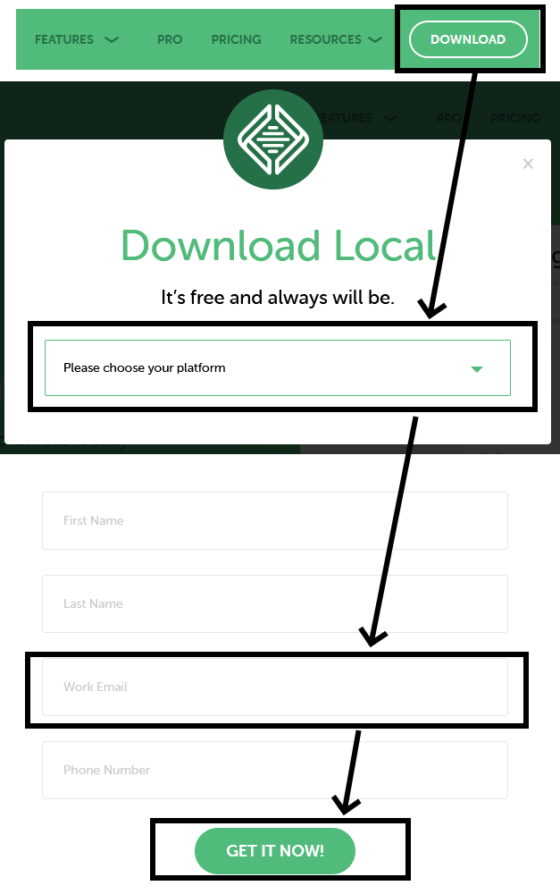

You do not need to provide a real email if you do not want to be contacted by Flywheel.

Follow the installer. If you are on mac, you may need to move the executable to your Applications folder. See the video in references for more information.

## 3.0 Creating a new site

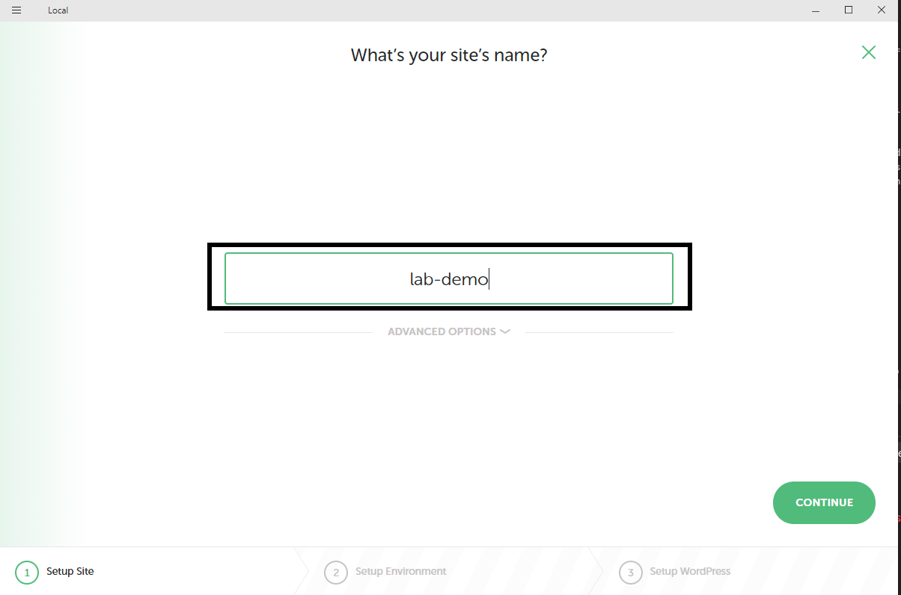

Local invokes multiple services / daemons. You may need to grant admin privileges.

You don't need to change any advanced settings yet, but later may wish to make use of the "blueprints" feature. This allows you to set up a site the way that you like it once, including adjusting settings and installing and configuring plugins and themes, and then make a copy of this which can later be reused, called blueprints.

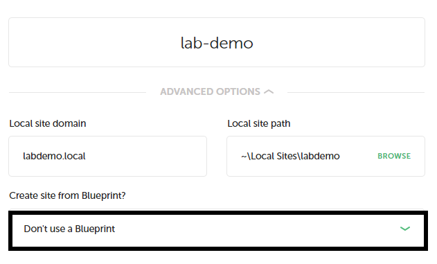

If you know the specific configuration of software needed for your server, you may configure the environment, but for our purposes the preferred configuration is fine for development.

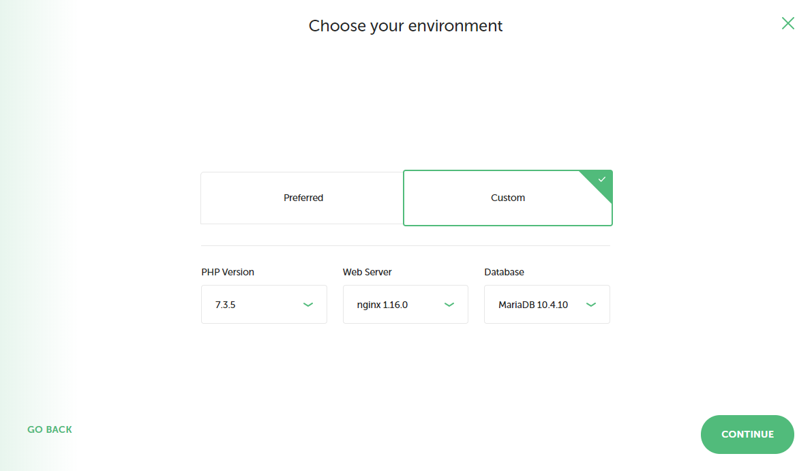

Wordpress has two web interfaces, one for the public which is available to all to see, and one for the admin used to perform administration, such as adding new content. The admin account can be accessed from any computer around the world, so naturally must be secured behind a username and password. Set these on the next screen. Make sure you remember these: if you forget them you will need to manually edit your database to reset this. The email you enter will occasionally get messages from Wordpress, letting you know if themes or plugins have been updated.

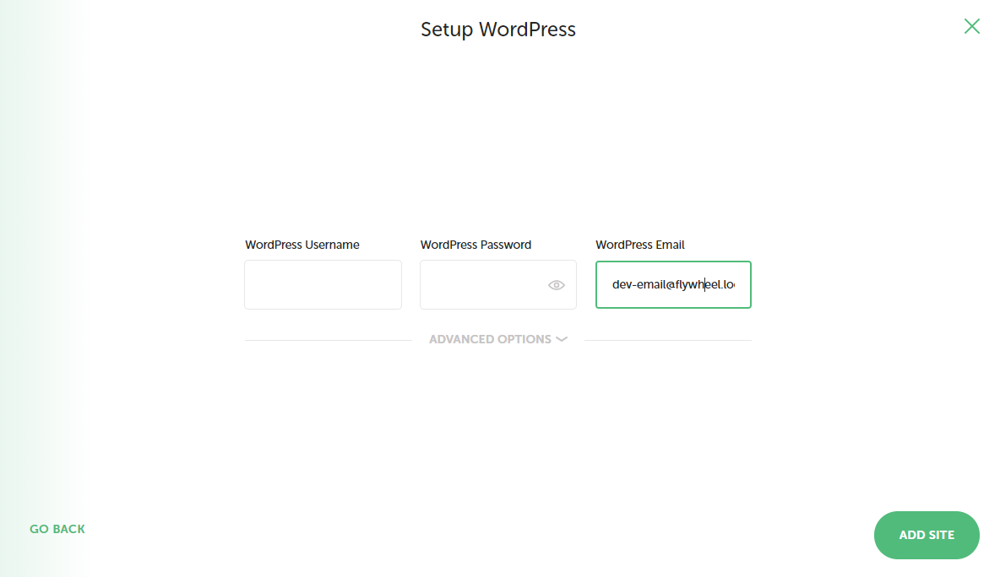

The advanced option allows mutli-site instances, which allow wordpress to host multiple sites on a single server. This can be useful to host several personal websites, like personal CVs and portfolios, for managing costs. However, it does reuse the same database for all sites, making migration later on a hassle.

Finally, click on Add Site. You may need to give Administrator privileges to start up web hosting daemons. It may take a while for your site to initialize, and then show the dashboard:

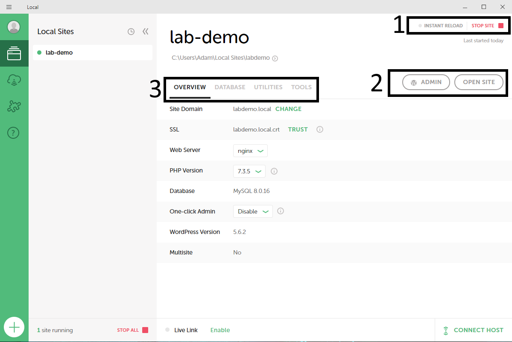

1. Here you can see if the site is running. You can stop or reload your server here. If you stop development and want to resume later, make sure you start up your local server.
2. You can open links to your site here, either the pubic facing site or the admin portal. By default, the admin portal is found at the subdirectory:
```
<your site>/wp-admin/
```
3. Here you can click through to see different aspects of the site system, including database and utilities.

## 4.0 A brief tour of Wordpress

First, click on the Open Site button to see the site as it exists.

This minimalist, placeholder site appears when you start up a new site, updated each year to demonstrate the current wordpress theme. 

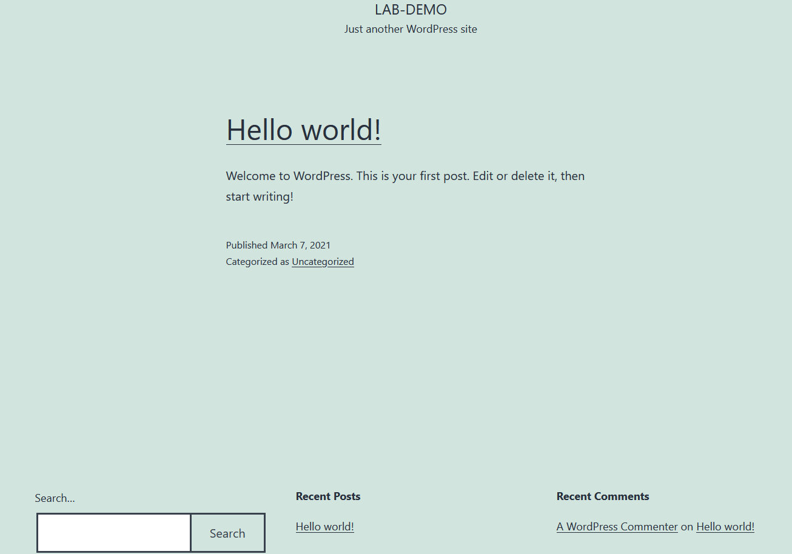

A Wordpress theme is a basic site design. It groups together elements like page templates, colors and other CSS styles, and modules coded in PHP. The guiding principle of a theme is to make your wordpress page look good out of the box, so that the developer can focus on generating content rather than fine tuning visual design, though a certain amount of broad customization is possible, and strongly required to give your site a unique visual identity. 

Each year wordpress updates the default theme to echo some contemporary web-design paradigms and popular techniques. A prominant paradigm today is the "site-builder" appraoch, modular sites which the user builds by selecting components and dropping them in place. This is the paradigm they are embracing with the "twenty-twenty-one" theme - you can modify your site layout by adding "blocks". Other plugins have existed to this historically, which are Elementor, WPBakery and BeaverBuilder. Generally speaking, these tools are very powerful, but take practice to use. Most of these tools have a free demo version with reduced capabilities, and a subscription based professional version, with more features. 

Wordpress themes are typically responsive by design, that is, the content reflows automatically for mobile devices. To see what the site looks like on a mobile, you can use mobile view in firefox: Ctrl+Shift+M

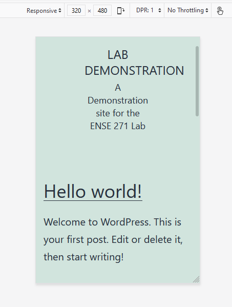

Let's check out the Admin portal next...

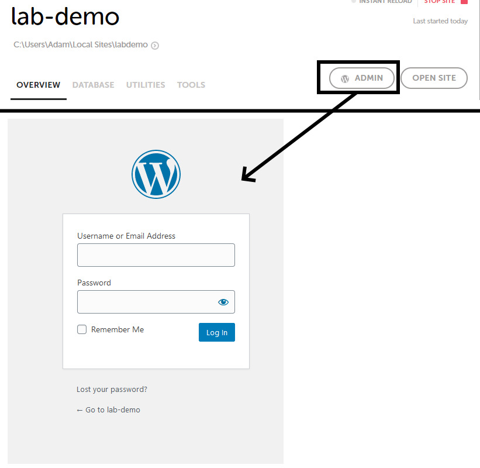

Log in with the password you set earlier.

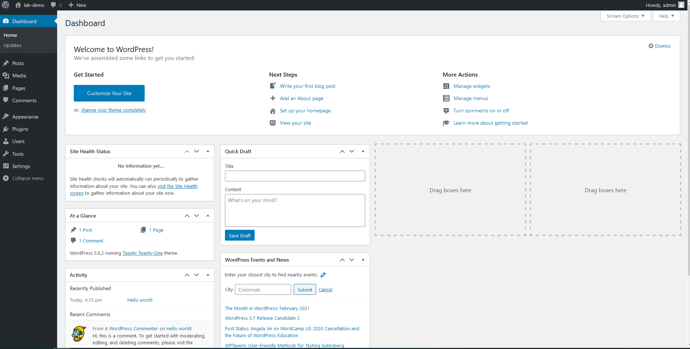

Our first step should be heading through settings, and configuring things as we like...

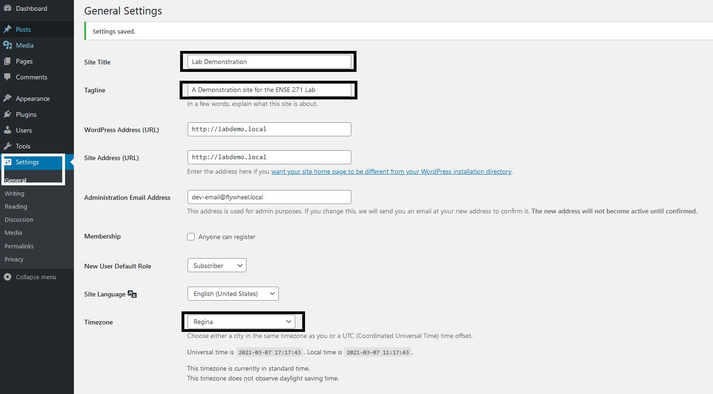

After this, if you reload the page, you should see some simple changes.

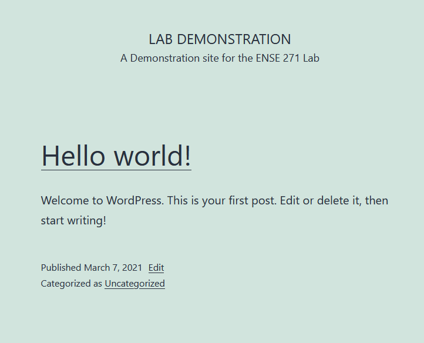

## 5.0 Design: Fine Tuning or Starting Fresh?

From here we have two main approaches to begin to make our wordpress site our own. The cleanest way to start over is to choose a new theme. However, let's see what we can do to customize this theme first...

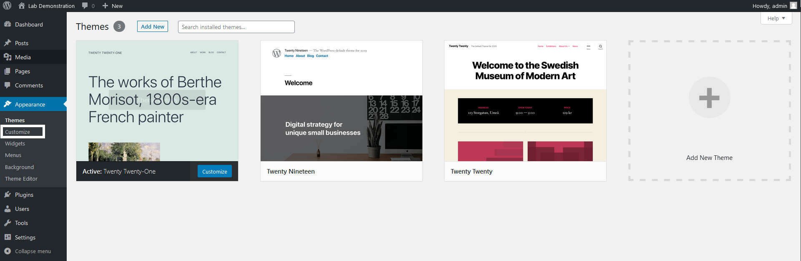

Click through the different pages to see what you can edit.

You can also see what it will look like on a mobile device using the controls in the bottom right...

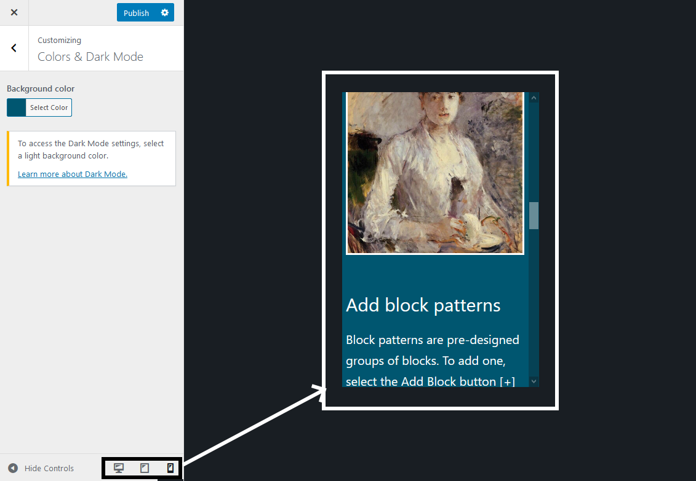

Let's try adding some content...

## 6.0 Adding Content

### Static Pages

You can add static pages from this menu 

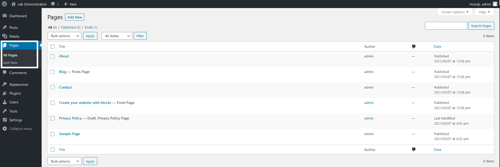

Add a few pages here. You can also delete some of the automatic pages if you don't need them anymore.

### Dynamic Blogs

Blogs posts - You can add dynamic blog posts from this menu:

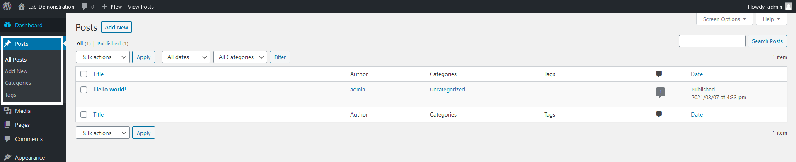

These by default will appear on the blog page, but could be moved to be on the main page.

### Menus

You may wish to have different menus in different places, for example in the top header menu and the footer menu. The menu section lets you tailor these to your liking:

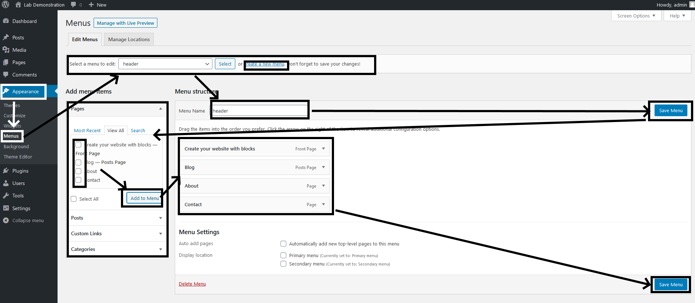

To create a new menu...
- Add a new menu
- Name it
- Save it
- Select pages to add
- Add the pages
- Save the menu

### Images

Images in wordpress are uploaded and stored in the local site files. 

##  7.0 Editing Static Pages and Site Building with Blocks

We'll look at dedicated plugins for this in next weeks lab, but for now let's take a peek and see how blocks work in the twenty-twenty-one theme...

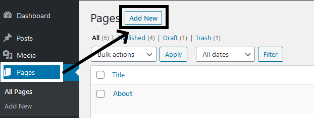

You can change the title and the paragraph. You can add new blocks using the top bar...

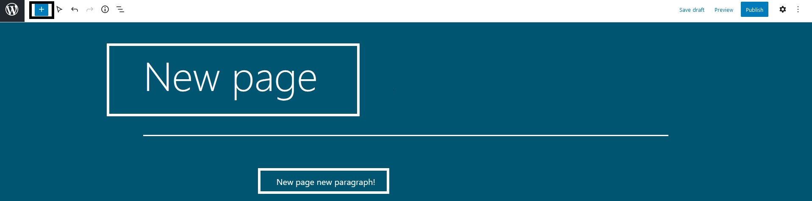

You can add blocks, which are like individual components, and patterns, which put smaller components together to make something useful. Always publish your pages when done to save changes.

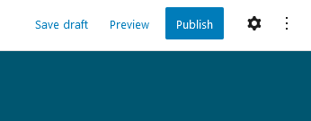

This should be enough of a tour to get you started. Next week we will continue to look at further customizing your wordpress sites.

## Assignment

Phase 1: 
- Make three static pages
    - Add two or three site builder blocks to each page
- Make a blog page with three entries
* Take some screenshots after finishing phase 1.

Phase 2:
- Find and install a theme you like, and activate it.
- Take a tour of your site. How have pages changed?
* Document these changes using screenshots

## Submission

- For this lab, please submit screenshots of your work, rather than your complete installation. 
    - include the screenshots in folders phase-1 and phase-2

---

## References

WPLearningLab. [How To Install WordPress Locally - Make A WordPress Local Development Environment](https://www.youtube.com/watch?v=GeDAUU4zciI). Updated 2021. 
